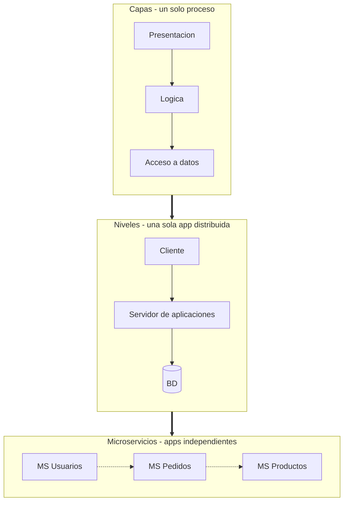

### 5.1 Capas, niveles y microservicios

Antes de hablar de comunicación conviene despejar una confusión frecuente. En la literatura sobre arquitectura de software se usan tres términos que suelen mezclarse: **capas** (*layers*), **niveles** (*tiers*) y **microservicios**. No son sinónimos, y confundirlos lleva a conclusiones equivocadas.

#### Capas: separación lógica de responsabilidades

Una **capa** es una división lógica del código por responsabilidad técnica. Presentación, lógica de negocio, acceso a datos. Todas las capas se ejecutan en el **mismo proceso**, dentro del mismo binario. No son separables en despliegue: no puedes desplegar "la capa de negocio" sin desplegar la aplicación entera.

#### Niveles: separación física de ejecución

Un **nivel** (*tier*) es una división física por separación de ejecución. Cada nivel corre en su propio proceso, su propia máquina o su propio contenedor. El ejemplo canónico es la arquitectura de **tres niveles**: cliente, servidor de aplicaciones, servidor de base de datos.

Los niveles **sí** son una estructura cliente-servidor jerárquica: el cliente pide al servidor de aplicaciones; este, a la base de datos. Es una cadena de llamadas donde cada nivel conoce al siguiente y depende de él.

> **La clave para no confundirse:** los tres niveles, juntos, forman **una sola aplicación**. Se despliegan coordinadamente. Cambiar el nivel de negocio obliga a coordinar con los otros niveles. Funcionalmente, es un **monolito distribuido**: una sola unidad de negocio repartida en varios procesos.

#### Microservicios: aplicaciones independientes por capacidad de negocio

Los microservicios **heredan de los niveles** la idea de separación de ejecución: cada servicio corre en su propio proceso. Pero introducen dos cambios fundamentales:

1. **Cambia el criterio de descomposición.** Ya no se separa por rol técnico (presentación, negocio, datos), sino por **capacidad de negocio** (usuarios, pedidos, productos).
2. **Cambia la unidad de despliegue.** Cada pieza deja de ser "un nivel de la misma aplicación" para convertirse en una **aplicación independiente**, con su propio ciclo de vida, su propia base de datos y su propio equipo.

Además, desaparece la jerarquía fija del modelo cliente-servidor: cualquier microservicio puede ser cliente de otro. No hay un "nivel superior" y un "nivel inferior"; hay un grafo de colaboraciones.

#### Comparación

| Pregunta | Capas | Niveles (tiers) | Microservicios |
|---|---|---|---|
| ¿Qué separa? | Responsabilidad técnica | Ejecución / despliegue | Capacidad de negocio |
| ¿Dónde se ejecuta? | Mismo proceso | Cada nivel en su proceso | Cada servicio en su proceso |
| ¿Forman una sola aplicación? | Sí | **Sí** (monolito distribuido) | **No** (aplicaciones independientes) |
| ¿Despliegue coordinado? | N/A | Sí, obligatorio | No, cada servicio es autónomo |
| Estructura de comunicación | Llamadas en memoria | Cliente-servidor jerárquico | Grafo de colaboraciones |
| Base de datos | Compartida | Compartida (típicamente en el nivel de datos) | Una por servicio |

#### La relación histórica

La arquitectura de tres niveles es una estructura cliente-servidor **antecesora** de los microservicios. Los microservicios no niegan los niveles: los **reinterpretan**. Conservan la separación de ejecución, pero sustituyen el criterio técnico por el criterio de negocio y rompen la unidad de aplicación. Lo que en tres niveles era "un sistema repartido en tres procesos" pasa a ser, en microservicios, "muchas aplicaciones pequeñas que colaboran".

**Implicación arquitectónica**: la descomposición por capacidad de negocio es lo que permite que cada microservicio tenga su propio ciclo de despliegue (**desplegabilidad**) y su propio equipo. La descomposición por capa técnica no lo permite: obliga a desplegar la aplicación completa.

