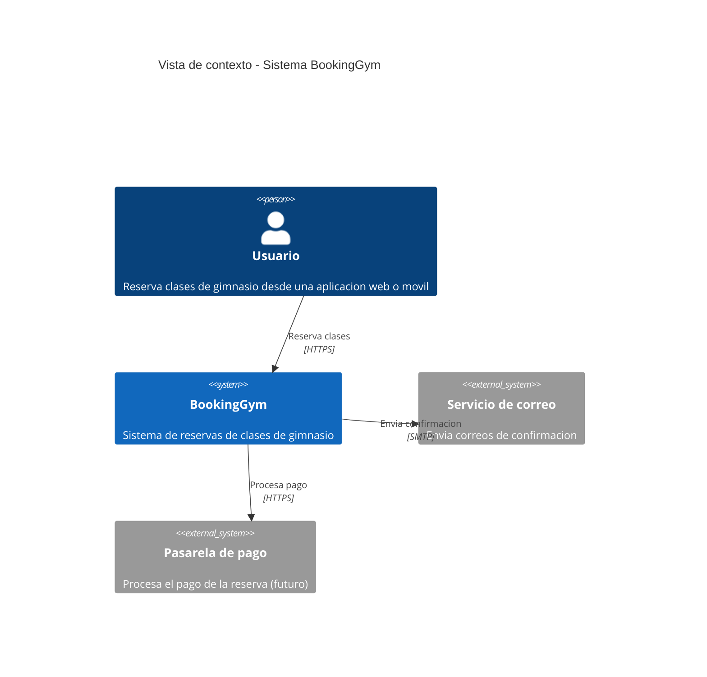
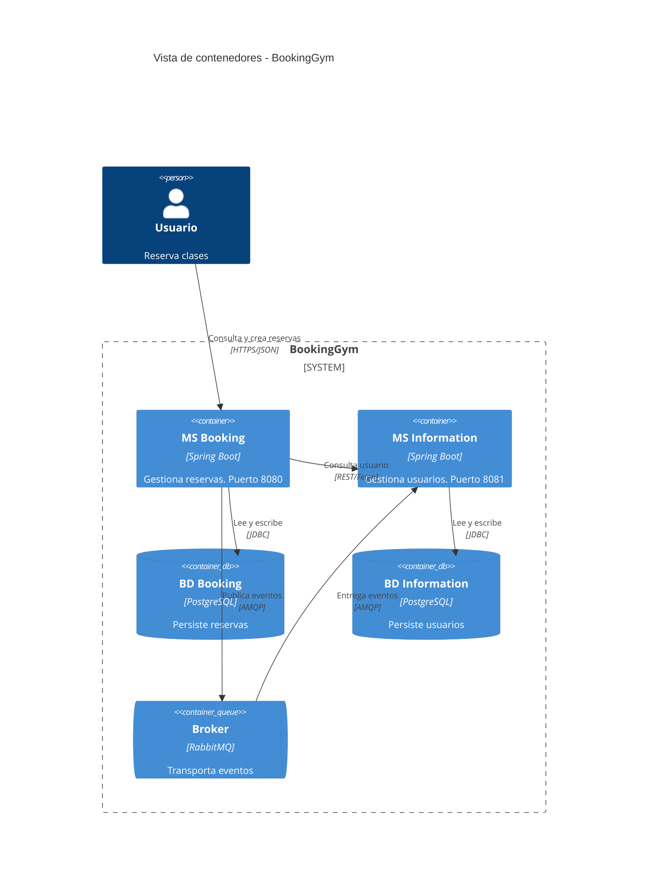
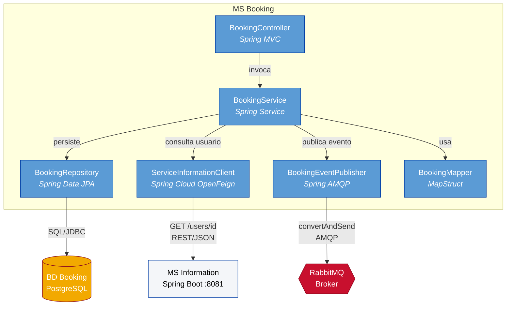
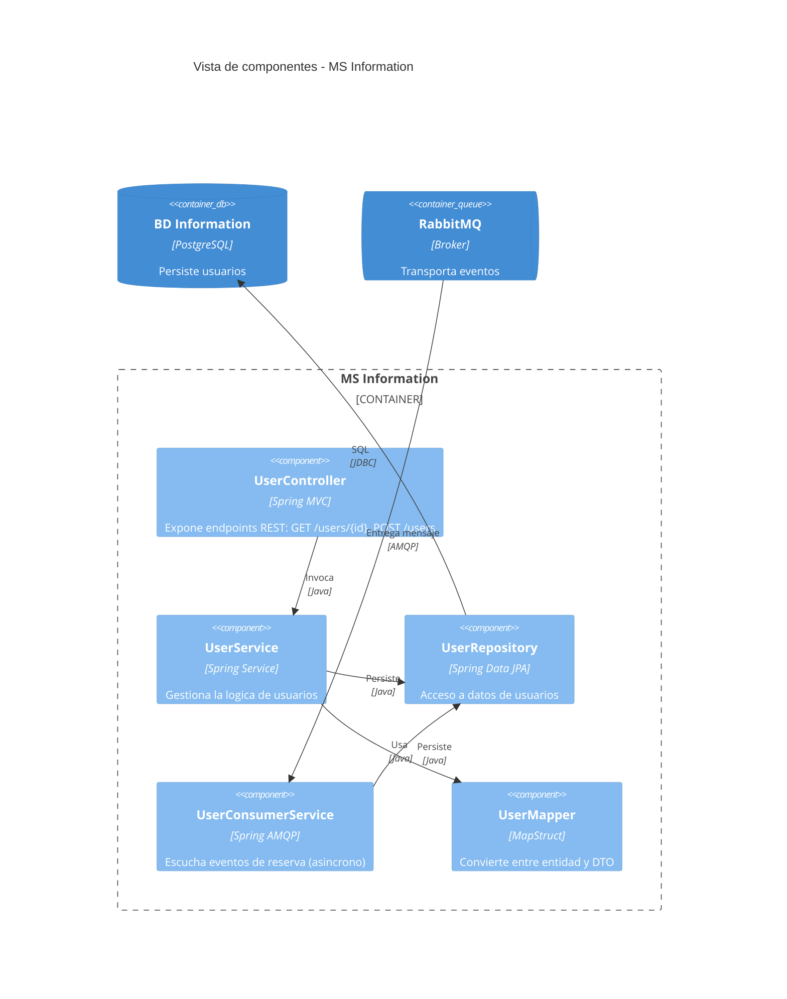
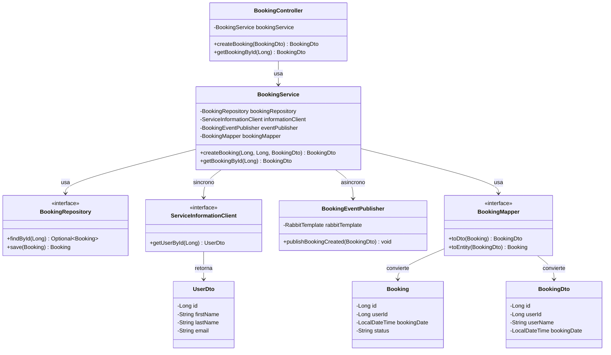
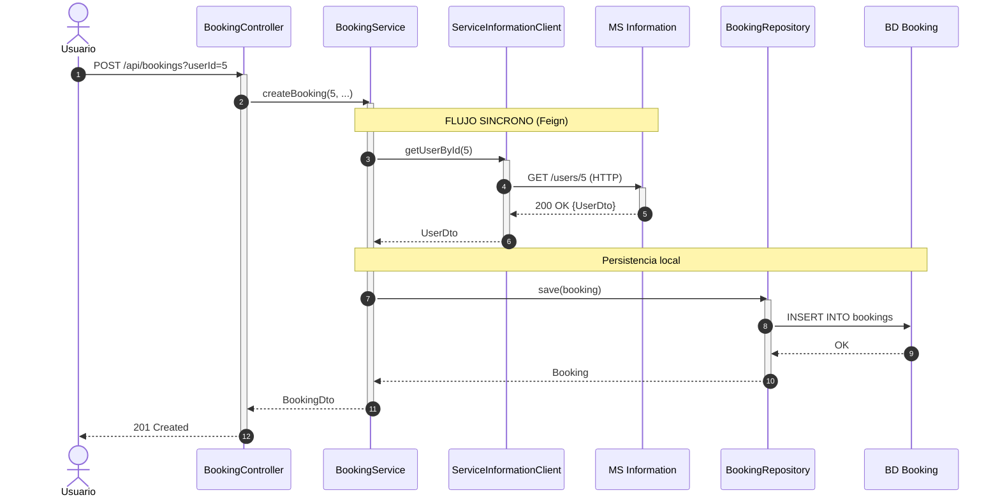
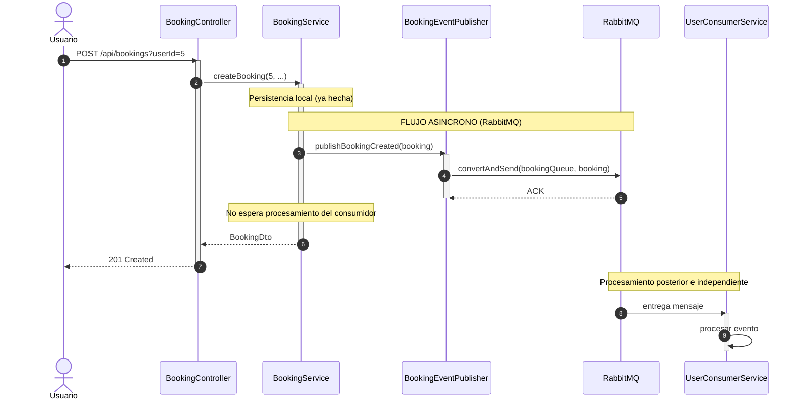

# BookingGym-Sync: Documentación de Implementación Técnica

**Proyecto:** Sistema de reservas de gimnasio con arquitectura de microservicios  
**Repositorio:** [`github.com/arielhurtado/springbootexamples`](https://github.com/arielhurtado/springbootexamples)  
**Versión:** 1.0  
**Fecha:** Octubre 2026

> **Alcance**: Este es un documento de implementación técnica (nivel de código). Utiliza la estructura del modelo C4 (Contexto, Contenedores, Componentes) para organizar la descripción, pero se enfoca en las decisiones de implementación y el código Java correspondiente.

---

## Tabla de contenido

1. [Introducción](#1-introducción)
2. [Vista de Contexto (C4 Nivel 1)](#2-vista-de-contexto-c4-nivel-1)
3. [Vista de Contenedores (C4 Nivel 2)](#3-vista-de-contenedores-c4-nivel-2)
4. [Vista de Componentes: MS Booking (C4 Nivel 3)](#4-vista-de-componentes-ms-booking-c4-nivel-3)
5. [Vista de Componentes: MS Information (C4 Nivel 3)](#5-vista-de-componentes-ms-information-c4-nivel-3)
6. [Vista de Código: Diagrama UML de Clases](#6-vista-de-código-diagrama-uml-de-clases)
7. [Vista de Interacción: Diagramas de Secuencia](#7-vista-de-interacción-diagramas-de-secuencia)
8. [Código Java Correspondiente](#8-código-java-correspondiente)
9. [Contraste: Síncrono vs Asíncrono](#9-contraste-síncrono-vs-asíncrono)
10. [Atributos de Calidad y Tácticas](#10-atributos-de-calidad-y-tácticas)
11. [Estilos Arquitectónicos Presentes](#11-estilos-arquitectónicos-presentes)

---

## 1. Introducción

**BookingGym-Sync** es un sistema de reservas de clases de gimnasio implementado como una arquitectura de microservicios. Está compuesto por dos aplicaciones Spring Boot independientes que colaboran a través de la red: **MS Booking** (puerto 8080) y **MS Information** (puerto 8081).

El sistema implementa dos estilos de comunicación complementarios, que conviven en el mismo sistema y responden a necesidades distintas:

- **Comunicación síncrona** mediante **Spring Cloud OpenFeign**: cuando el servicio de Booking necesita datos de usuario para completar una reserva, invoca directamente al servicio de Information y espera la respuesta. Sin esa respuesta, la operación no puede continuar.
- **Comunicación asíncrona** mediante **RabbitMQ**: cuando el servicio de Booking completa una reserva, publica un evento en una cola. Los consumidores (notificaciones, auditoría, analítica) procesan el evento a su ritmo, sin bloquear al productor.

Cada microservicio mantiene su propia base de datos PostgreSQL, siguiendo el patrón **Database per Service**. Esto garantiza autonomía de despliegue y evolución independiente, aunque introduce el costo de no poder realizar joins cruzados entre servicios.

---

## 2. Vista de Contexto (C4 Nivel 1)

El diagrama de contexto muestra el sistema como una caja negra y sus interacciones con usuarios y sistemas externos.



**Lectura del diagrama**: El usuario interactúa con el sistema BookingGym a través de HTTPS. El sistema, a su vez, se integra con un servicio de correo (para notificaciones) y una pasarela de pago (prevista para futuras versiones). Estos sistemas externos están fuera del alcance del proyecto y se representan como cajas negras.

---

## 3. Vista de Contenedores (C4 Nivel 2)

El diagrama de contenedores abre la caja negra del sistema y muestra las aplicaciones, bases de datos y brokers que lo componen. Nótese que **ambos canales de comunicación están presentes simultáneamente**: la llamada síncrona vía Feign y la publicación asíncrona vía RabbitMQ.


```

**Lectura arquitectónica del diagrama**:

| Elemento | Tipo | Atributo que promueve |
|---|---|---|
| MS Booking, MS Information | Aplicación | **Desplegabilidad**: cada uno se despliega de forma autónoma |
| BD Booking, BD Information | Almacén de datos | **Desplegabilidad, modificabilidad**: cada servicio es dueño de su esquema |
| RabbitMQ | Cola de mensajes | **Disponibilidad, escalabilidad**: desacopla productor y consumidor |
| Feign (conector síncrono) | Llamada-return | **Consistencia fuerte**: la respuesta se obtiene en el momento |
| RabbitMQ (conector asíncrono) | Publish-subscribe | **Disponibilidad, escalabilidad**: el productor no espera |

---

## 4. Vista de Componentes: MS Booking (C4 Nivel 3)

El diagrama de componentes abre el contenedor MS Booking y muestra sus piezas internas. Obsérvese que **coexisten dos conectores de salida**: uno síncrono (`ServiceInformationClient`) y uno asíncrono (`BookingEventPublisher`).



**Lectura arquitectónica del diagrama**:

| Componente | Rol arquitectónico | Atributo que promueve |
|---|---|---|
| `BookingController` | Adaptador de entrada | **Interoperabilidad**: expone REST al exterior |
| `BookingService` | Orquestador | **Modificabilidad**: concentra la lógica de negocio |
| `BookingRepository` | Adaptador de salida | **Modificabilidad**: aísla el acceso a datos |
| `ServiceInformationClient` | Conector síncrono | **Consistencia fuerte** |
| `BookingEventPublisher` | Conector asíncrono | **Disponibilidad, escalabilidad** |
| `BookingMapper` | Traductor | **Mantenibilidad, testabilidad** |

---

## 5. Vista de Componentes: MS Information (C4 Nivel 3)



---

## 6. Vista de Código: Diagrama UML de Clases

El diagrama UML muestra las clases principales del sistema y sus relaciones.



---

## 7. Vista de Interacción: Diagramas de Secuencia

Aquí se ilustran **los dos flujos del sistema**, uno por cada estilo de comunicación. Ambos ocurren durante el mismo caso de uso (`createBooking`), pero en momentos distintos.

### 7.1 Flujo síncrono — Consulta de usuario vía Feign

Cuando el usuario crea una reserva, el servicio de Booking **necesita** los datos del usuario para validar que existe. Esta información la obtiene **de forma síncrona** del servicio de Information. La operación de reserva queda bloqueada hasta recibir la respuesta.



**Observaciones**:

- El bloque entre `S` y `I` es **bloqueante**: la operación no puede continuar sin la respuesta.
- Si `MS Information` cae, `MS Booking` **no puede completar la reserva** (a menos que se implementen mecanismos de fallback).
- La consistencia es **fuerte**: al terminar la transacción, el usuario existe y la reserva está persistida.

### 7.2 Flujo asíncrono — Publicación de evento vía RabbitMQ

Una vez creada la reserva, el servicio de Booking **publica un evento** en RabbitMQ y **no espera** confirmación. Otros servicios (como MS Information, para notificar al usuario) consumirán ese evento a su ritmo.



**Observaciones**:

- El bloque entre `S` y `Q` **no es bloqueante**: en cuanto el broker confirma la recepción, el productor continúa.
- Si el consumidor (`UserConsumerService`) cae, los mensajes se acumulan en la cola y se procesan cuando vuelva.
- La consistencia es **eventual**: el consumidor puede tardar en procesar, pero eventualmente lo hará.
- El productor **no conoce** a los consumidores. Puede haber cero, uno o muchos.

### 7.3 Contraste visual

Poniendo los dos diagramas uno al lado del otro, el contraste es claro:

| Aspecto | Flujo síncrono (7.1) | Flujo asíncrono (7.2) |
|---|---|---|
| **Bloquea al productor** | ✅ Sí | ❌ No |
| **Necesita al receptor en línea** | ✅ Sí | ❌ No |
| **Tolerancia a fallo del receptor** | 🔴 Baja | 🟢 Alta |
| **Consistencia** | Fuerte | Eventual |
| **Conocimiento del receptor** | Explícito (Feign) | Ninguno (publish-subscribe) |

---

## 8. Código Java Correspondiente

### 8.1 Entidad JPA — Booking

```java
@Entity
@Table(name = "bookings")
public class Booking {

    @Id
    @GeneratedValue(strategy = GenerationType.IDENTITY)
    private Long id;

    @Column(name = "user_id", nullable = false)
    private Long userId;

    @Column(name = "booking_date", nullable = false)
    private LocalDateTime bookingDate;

    @Column(nullable = false)
    private String status;

    // getters y setters
}
```

### 8.2 DTO de salida — BookingDto

```java
public class BookingDto {

    private Long id;
    private Long userId;
    private String userName;
    private LocalDateTime bookingDate;

    public BookingDto(Booking booking) {
        this.id = booking.getId();
        this.userId = booking.getUserId();
        this.bookingDate = booking.getBookingDate();
    }

    // getters y setters
}
```

### 8.3 Cliente Feign — ServiceInformationClient

```java
@FeignClient(name = "information-microservice",
             url = "http://localhost:8081/api/information")
public interface ServiceInformationClient {

    @GetMapping("/users/{id}")
    UserDto getUserById(@PathVariable("id") Long id);
}
```

### 8.4 Publicador de eventos — BookingEventPublisher

```java
@Service
public class BookingEventPublisher {

    private final RabbitTemplate rabbitTemplate;

    public BookingEventPublisher(RabbitTemplate rabbitTemplate) {
        this.rabbitTemplate = rabbitTemplate;
    }

    public void publishBookingCreated(BookingDto booking) {
        rabbitTemplate.convertAndSend(
            RabbitMQConfig.BOOKING_QUEUE, booking);
    }
}
```

### 8.5 Servicio — BookingService (integra ambos flujos)

```java
@Service
public class BookingService {

    private final BookingRepository bookingRepository;
    private final ServiceInformationClient informationClient;
    private final BookingEventPublisher eventPublisher;
    private final BookingMapper bookingMapper;

    public BookingService(BookingRepository bookingRepository,
                          ServiceInformationClient informationClient,
                          BookingEventPublisher eventPublisher,
                          BookingMapper bookingMapper) {
        this.bookingRepository = bookingRepository;
        this.informationClient = informationClient;
        this.eventPublisher = eventPublisher;
        this.bookingMapper = bookingMapper;
    }

    @Transactional
    public BookingDto createBooking(Long userId, Long gymClassId,
                                    BookingDto bookingDto) {
        try {
            // --- FLUJO SINCRONO ---
            // Consulta bloqueante al MS Information
            UserDto user = informationClient.getUserById(userId);

            Booking booking = new Booking();
            booking.setUserId(userId);
            booking.setBookingDate(LocalDateTime.now());
            booking.setStatus("CONFIRMED");

            Booking saved = bookingRepository.save(booking);
            BookingDto savedDto = bookingMapper.toDto(saved);

            // --- FLUJO ASINCRONO ---
            // Publica evento, no espera consumidor
            eventPublisher.publishBookingCreated(savedDto);

            return savedDto;

        } catch (FeignException.NotFound e) {
            throw new EntityNotFoundException(
                "El usuario con ID " + userId + " no existe");
        } catch (FeignException e) {
            throw new RuntimeException(
                "Error al invocar el microservicio de informacion: "
                + e.getMessage(), e);
        }
    }

    @Transactional(readOnly = true)
    public BookingDto getBookingById(Long id) {
        Booking booking = bookingRepository.findById(id)
                .orElseThrow(() -> new EntityNotFoundException(
                    "Reserva no encontrada con ID: " + id));
        return bookingMapper.toDto(booking);
    }
}
```

**Observación**: en el mismo método `createBooking` conviven **ambos flujos**. Primero se hace la llamada síncrona (bloqueante) para validar el usuario; luego se persiste localmente; finalmente se publica el evento asíncrono (no bloqueante).

### 8.6 Mapper MapStruct — BookingMapper

```java
@Mapper(componentModel = "spring")
public interface BookingMapper {

    BookingDto toDto(Booking booking);

    @Mapping(target = "id", ignore = true)
    Booking toEntity(BookingDto bookingDto);
}
```

### 8.7 Controlador REST — BookingController

```java
@RestController
@RequestMapping("/api/bookings")
public class BookingController {

    private final BookingService bookingService;

    public BookingController(BookingService bookingService) {
        this.bookingService = bookingService;
    }

    @PostMapping
    public ResponseEntity<BookingDto> createBooking(
            @RequestParam Long userId,
            @RequestParam Long gymClassId,
            @RequestBody BookingDto bookingDto) {
        BookingDto created = bookingService.createBooking(
                userId, gymClassId, bookingDto);
        return new ResponseEntity<>(created, HttpStatus.CREATED);
    }

    @GetMapping("/{id}")
    public ResponseEntity<BookingDto> getBookingById(@PathVariable Long id) {
        BookingDto booking = bookingService.getBookingById(id);
        return ResponseEntity.ok(booking);
    }
}
```

### 8.8 Configuración de RabbitMQ

```java
@Configuration
public class RabbitMQConfig {

    public static final String BOOKING_QUEUE = "bookingQueue";

    @Bean
    public Queue bookingQueue() {
        return new Queue(BOOKING_QUEUE, true); // durable
    }

    @Bean
    public Jackson2JsonMessageConverter jsonMessageConverter() {
        return new Jackson2JsonMessageConverter();
    }

    @Bean
    public RabbitTemplate rabbitTemplate(ConnectionFactory cf) {
        RabbitTemplate template = new RabbitTemplate(cf);
        template.setMessageConverter(jsonMessageConverter());
        return template;
    }
}
```

### 8.9 Consumidor de eventos — UserConsumerService

```java
@Service
public class UserConsumerService {

    private final UserRepository userRepository;

    public UserConsumerService(UserRepository userRepository) {
        this.userRepository = userRepository;
    }

    @RabbitListener(queues = RabbitMQConfig.BOOKING_QUEUE)
    public void receiveBookingEvent(BookingDto booking) {
        System.out.println("Evento de reserva recibido: " + booking.getId());
        // Logica adicional: notificaciones, auditoria, etc.
    }
}
```

### 8.10 Aplicación principal — BookingApplication

```java
@SpringBootApplication
@EnableFeignClients
public class BookingApplication {

    public static void main(String[] args) {
        SpringApplication.run(BookingApplication.class, args);
    }
}
```

---

## 9. Contraste: Síncrono vs Asíncrono

Esta sección resume el trade-off fundamental del sistema. **Ambos estilos conviven** porque resuelven necesidades distintas.

### 9.1 Tabla comparativa

| Atributo | Síncrono (Feign) | Asíncrono (RabbitMQ) |
|---|---|---|
| **Disponibilidad** | 🔴 Baja: si el remoto cae, el llamador falla | 🟢 Alta: los mensajes se acumulan en la cola |
| **Escalabilidad** | 🟡 Media: la cadena crece con la carga | 🟢 Alta: el broker desacopla productor y consumidor |
| **Modificabilidad** | 🟡 Media: ambos servicios conocen el contrato | 🟢 Alta: el productor no conoce a los consumidores |
| **Consistencia** | 🟢 Fuerte: el estado se actualiza en el momento | 🔴 Eventual: el estado converge con el tiempo |
| **Complejidad operativa** | 🟢 Baja: solo HTTP | 🔴 Alta: hay un broker que mantener |
| **Depuración** | 🟢 Lineal: una llamada, una respuesta | 🔴 No lineal: el flujo se reparte por la cola |
| **Idempotencia** | 🟢 Trivial: cada llamada es independiente | 🔴 Requerida: los mensajes pueden duplicarse |
| **Latencia percibida** | 🔴 Incluye la llamada remota | 🟢 Publicación inmediata |

### 9.2 Regla práctica de decisión

> **Si necesitas la respuesta para continuar**, usa comunicación síncrona.
> **Si puedes describir la operación como "y luego..."**, usa comunicación asíncrona.

En `BookingGym-Sync`:

- **Síncrono**: obtener el usuario antes de crear la reserva. No tiene sentido crear una reserva para un usuario inexistente.
- **Asíncrono**: notificar al usuario, auditar la reserva, actualizar analítica. Son operaciones que pueden ocurrir después, sin bloquear al usuario.

---

## 10. Atributos de Calidad y Tácticas

Cada decisión técnica del sistema puede leerse como una **táctica arquitectónica** que promueve un atributo de calidad:

| Táctica | Atributo que promueve | Dónde aparece |
|---|---|---|
| Encapsular estructura interna con DTOs | Modificabilidad, seguridad | `BookingDto`, `UserDto` |
| Separar DTOs de entrada y salida | Modificabilidad, seguridad | `BookingController` |
| Automatizar mapeo con MapStruct | Mantenibilidad, testabilidad | `BookingMapper` |
| Una base de datos por servicio | Desplegabilidad, autonomía | `bdBooking`, `bdInformation` |
| Comunicación síncrona con Feign | Consistencia fuerte, simplicidad | `ServiceInformationClient` |
| Comunicación asíncrona con RabbitMQ | Disponibilidad, escalabilidad | `BookingEventPublisher` |
| Traducir excepciones técnicas a dominio | Modificabilidad | `BookingService` |
| Manejar idempotencia en consumidores | Disponibilidad | `UserConsumerService` |

**Trade-off fundamental**: El sistema privilegia la **desplegabilidad** y **modificabilidad** sobre la **consistencia inmediata global** y la **simplicidad operativa**. Cada microservicio puede desplegarse de forma autónoma, pero a cambio se introduce complejidad de red: latencia, fallos parciales, consistencia eventual.

La combinación de ambos estilos de comunicación es precisamente lo que permite **balancear** esos atributos: lo crítico va por síncrono (consistencia fuerte), lo no crítico va por asíncrono (disponibilidad y escalabilidad).

---

## 11. Estilos Arquitectónicos Presentes

En términos de la clasificación **Componentes y Conectores (C&C)** de Kruchten, el sistema combina tres estilos:

| Estilo | Dónde aparece | Conector característico |
|---|---|---|
| **Cliente-servidor** | Comunicación entre MS Booking y MS Information vía Feign | Llamada-return (REST) |
| **Publish-subscribe** | Comunicación con RabbitMQ | Publicación de eventos |
| **Layered (capas)** | Dentro de cada microservicio (controller → service → repository) | Llamada en memoria |

Los tres estilos **conviven simultáneamente** en el sistema. No hay uno "mejor" que otro: cada uno resuelve un tipo de interacción distinto y promueve atributos distintos. Un sistema maduro combina varios estilos según las necesidades de cada flujo.

---

**Documentación generada para el proyecto BookingGym-Sync**  
*Universidad del Cauca — Ingeniería de Software — Grupo IDIS*  
*Popayán, 2026*
